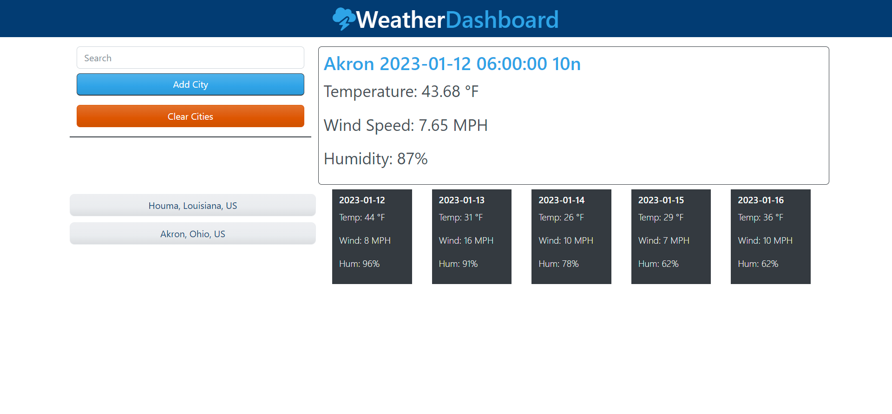

# weather-fiesta
API project that allows users to query 5-day Weather Forecasts by city 

## Description
This little website uses APIs to gather weather forecast data for just about any city in the world.  Most of the features on the left side of the page are clickable buttons to help a user select and save a city for which they'd like to see a forecast.  

## Current Bugs
*I failed to convert the API weather icon code into a displayable icon. Simply ran out of time. Will get to that at the next opportunity.

*There is no limit to the number of cities a user can save. I think it would be wise to limit it to ~15, but I have not done that.

## Installation
The website is accessible at the links below. You can navigate there with any functional web browser.

## Usage
Navigate to the webpage. Enter a city into the search bar, then click "Add City." A list of up to 5 options will populate; choose the best match.  This saves the city to a list of cities whose forecast you can access; to do so, simply click on the saved city and watch the data come in!

## Screenshot

## Links
https://github.com/neffej/weather-fiesta

https://neffej.github.io/weather-fiesta 
##

### References
I used the following websites to help progress through this coding Challenge. Most of the coding in this webpage is rudimentary, although there is a lot of it and it weaves a very tangled web in handing data from a user to an API and back and forth again, before finally displaying the desired information.  The iterative nature of 5-day forecasts created a challenge in this website.  

https://openweathermap.org/api

https://openweathermap.org/weather-conditions#How-to-get-icon-URL

https://flexiple.com/javascript/get-average-of-array-javascript/

